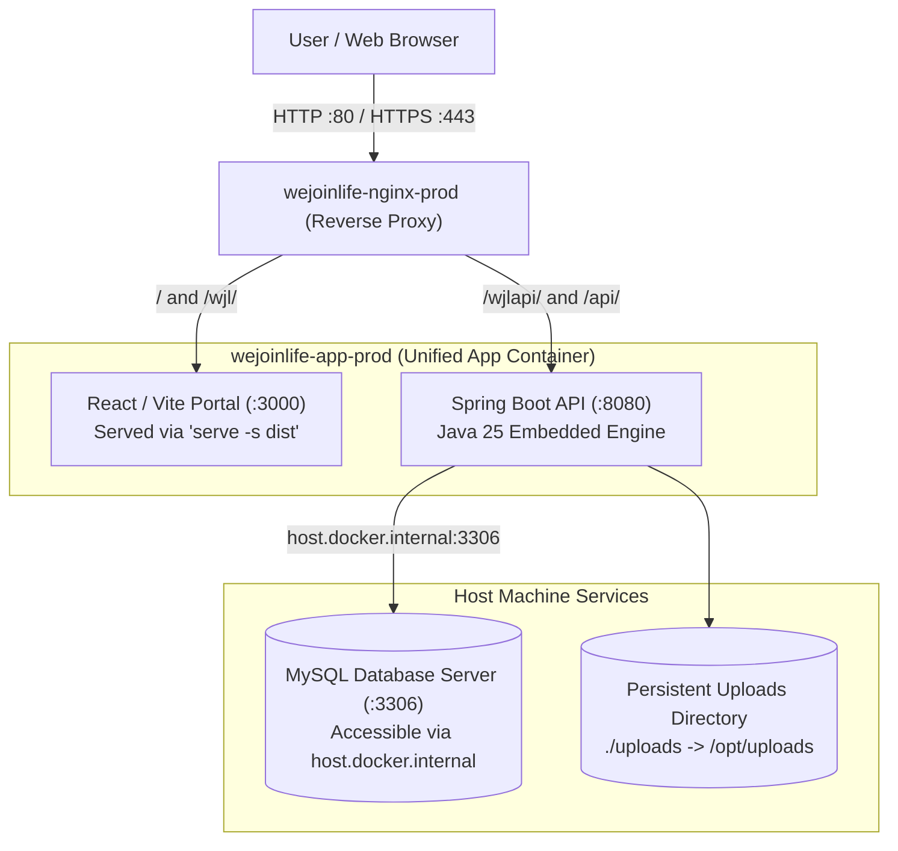

# WeJoinLife - Production Server Deployment Guide

This guide outlines how to deploy and manage **WeJoinLife** on a production Linux server (Ubuntu/Debian/RHEL) using Docker and Docker Compose, mirroring the container architecture of `eda-health-hub`.

---

## 1. System Architecture Overview



### Components
1. **`wejoinlife-app`**: A multi-stage production container running:
   - **Backend**: Spring Boot REST API with Java 25 target on port `8080`.
   - **Frontend**: React + Vite SPA on port `3000` (served with static SPA routing via Node `serve`).
2. **`nginx`**: Frontline reverse proxy running on port `80` and `443` with Brotli and Gzip compression, routing `/wjl/` to the React portal and `/wjlapi/` / `/api/` to the Spring Boot REST API.
3. **Database**: Can run as MySQL on the host system (resolved cleanly via `host.docker.internal:3306`), or on an external database server (AWS RDS / Cloud SQL / DigitalOcean Managed DB).

---

## 2. Server Prerequisites

On your production server (e.g. Ubuntu 22.04 / 24.04 LTS):

### A. Install Docker & Docker Compose
```bash
# Update package lists
sudo apt update && sudo apt upgrade -y

# Install Docker dependencies
sudo apt install -y ca-certificates curl gnupg lsb-release

# Add Docker's official GPG key & repository
sudo install -m 0755 -d /etc/apt/keyrings
curl -fsSL https://download.docker.com/linux/ubuntu/gpg | sudo gpg --dearmor -o /etc/apt/keyrings/docker.gpg
sudo chmod a+r /etc/apt/keyrings/docker.gpg

echo \
  "deb [arch=$(dpkg --print-architecture) signed-by=/etc/apt/keyrings/docker.gpg] https://download.docker.com/linux/ubuntu \
  $(lsb_release -cs) stable" | sudo tee /etc/apt/sources.list.d/docker.list > /dev/null

# Install Docker Engine and Docker Compose plugin
sudo apt update
sudo apt install -y docker-ce docker-ce-cli containerd.io docker-buildx-plugin docker-compose-plugin

# Allow running Docker without sudo
sudo usermod -aG docker $USER
newgrp docker

# Verify installation
docker --version
docker compose version
```

### B. Configure Firewall
Ensure ports 80 (HTTP) and 443 (HTTPS) are open:
```bash
sudo ufw allow 80/tcp
sudo ufw allow 443/tcp
sudo ufw allow 22/tcp
sudo ufw enable
```

---

## 3. Step-by-Step Deployment

### Step 1: Clone Repository onto Production Server
```bash
cd /opt
sudo git clone <YOUR_GIT_REPO_URL> wejoinlife
cd wejoinlife
sudo chown -R $USER:$USER /opt/wejoinlife
```

### Step 2: Configure Production Environment Variables (`.env`)
Copy `.env.example` to create your active `.env`:
```bash
cp .env.example .env
nano .env
```

Review and update the following key variables in `.env`:
```ini
# Production Environment
NODE_ENV=production

# Database Connection
# If MySQL is installed directly on this host server:
DB_HOST=host.docker.internal
DB_PORT=3306
DB_NAME=vconnect_prod_portal
DB_USERNAME=your_db_username
DB_PASSWORD=your_db_password

# Multi-Database Schema Mapping (if using split catalog/portal schemas)
PORTAL_DB=vconnect_prod_portal
CATALOG_DB=vconnect_prod_catalog
VCONNECT_DB=vconnect

# Domain & Cookie Settings
# Set your domain for cross-subdomain SSO cookies, e.g.:
JWT_COOKIE_DOMAIN=.vconnectlive.com

# Production JWT Secret (must be a strong 256-bit hexadecimal string)
JWT_SECRET=YOUR_SECURE_256_BIT_SECRET_KEY_HERE
CLIENT_PASS_SALT=38fc4120
```

> [!TIP]
> To generate a secure 256-bit JWT secret, run:
> ```bash
> openssl rand -hex 32
> ```

---

### Step 3: Build & Launch Containers
Launch the stack in detached mode using `docker-compose.prod.yml`:
```bash
docker compose -f docker-compose.prod.yml up -d --build
```

Docker will:
1. Compile the Spring Boot API with Maven on Java 25.
2. Compile the React frontend with Vite.
3. Package both into `wejoinlife-app-prod`.
4. Build `wejoinlife-nginx-prod`.
5. Launch both containers and configure networking.

---

### Step 4: Verify Deployment & Logs
Check container health and status:
```bash
docker compose -f docker-compose.prod.yml ps
```

Expected output:
```text
NAME                   IMAGE                    COMMAND                  SERVICE          STATUS
wejoinlife-app-prod    wejoinlife-wejoinlife-app   "/app/start.sh"       wejoinlife-app   Up (healthy)
wejoinlife-nginx-prod  wejoinlife-nginx            "nginx -g 'daemon of…"   nginx            Up
```

Stream unified logs to verify the Spring Boot startup and React serving:
```bash
docker compose -f docker-compose.prod.yml logs -f
```

To view logs for the application only:
```bash
docker compose -f docker-compose.prod.yml logs -f wejoinlife-app
```

---

## 4. Domain & SSL / HTTPS Setup

### Option A: Cloudflare (Recommended for simplicity & DDoS protection)
1. Point your domain's DNS `A` record (e.g., `portal.vconnectlive.com`) to your server IP.
2. Enable Cloudflare Proxy (Orange Cloud).
3. Set SSL/TLS mode to **"Full"** or **"Full (Strict)"** in Cloudflare.
4. Nginx port 80 will immediately receive traffic with SSL terminated at the Cloudflare edge.

### Option B: Let's Encrypt / Certbot on Host
If you manage SSL directly on the server:
1. Install Certbot:
   ```bash
   sudo apt install -y certbot
   ```
2. Stop the container temporarily or use webroot mode:
   ```bash
   sudo certbot certonly --standalone -d portal.vconnectlive.com
   ```
3. Mount the certificates into `docker-compose.prod.yml` under `nginx`:
   ```yaml
   volumes:
     - /etc/letsencrypt:/etc/letsencrypt:ro
   ```
4. Update `nginx.conf` with the SSL certificate block:
   ```nginx
   server {
       listen 443 ssl http2;
       server_name portal.vconnectlive.com;

       ssl_certificate /etc/letsencrypt/live/portal.vconnectlive.com/fullchain.pem;
       ssl_certificate_key /etc/letsencrypt/live/portal.vconnectlive.com/privkey.pem;

       location / {
           proxy_pass http://wejoinlife-app:3000;
           ...
       }
       location /wjlapi/ {
           proxy_pass http://wejoinlife-app:8080/wjlapi/;
           ...
       }
   }
   ```

---

## 5. Routine Maintenance & Operations

### Deploying Updates / Code Changes
To deploy an updated release without manual downtime:
```bash
cd /opt/wejoinlife
git pull origin main
docker compose -f docker-compose.prod.yml up -d --build
```
Docker will rebuild the layers that changed and gracefully replace the running containers.

### Restarting the Services
```bash
# Restart entire stack
docker compose -f docker-compose.prod.yml restart

# Restart app container only
docker compose -f docker-compose.prod.yml restart wejoinlife-app
```

### Stopping the Stack
```bash
docker compose -f docker-compose.prod.yml down
```

### Viewing Resource Consumption
Monitor CPU and RAM usage in real time:
```bash
docker stats
```

---

## 6. Troubleshooting Common Issues

### Issue 1: `Connection refused` when connecting to MySQL on Host
- **Cause**: MySQL on the host is bound only to `127.0.0.1`, ignoring Docker network requests.
- **Solution**: Open `/etc/mysql/mysql.conf.d/mysqld.cnf` on host and ensure:
  ```ini
  bind-address = 0.0.0.0
  ```
  Then restart MySQL:
  ```bash
  sudo systemctl restart mysql
  ```
- Also verify that the MySQL user has permissions from any host (`'user'@'%'`):
  ```sql
  GRANT ALL PRIVILEGES ON vconnect_prod_portal.* TO 'your_db_username'@'%' IDENTIFIED BY 'your_db_password';
  FLUSH PRIVILEGES;
  ```

### Issue 2: `502 Bad Gateway` on Nginx
- **Cause**: `wejoinlife-app` is still compiling or booting up, or Spring Boot failed to connect to database.
- **Solution**: Check backend logs:
  ```bash
  docker compose -f docker-compose.prod.yml logs --tail 100 wejoinlife-app
  ```
